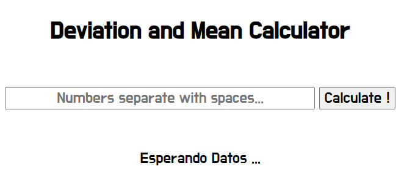
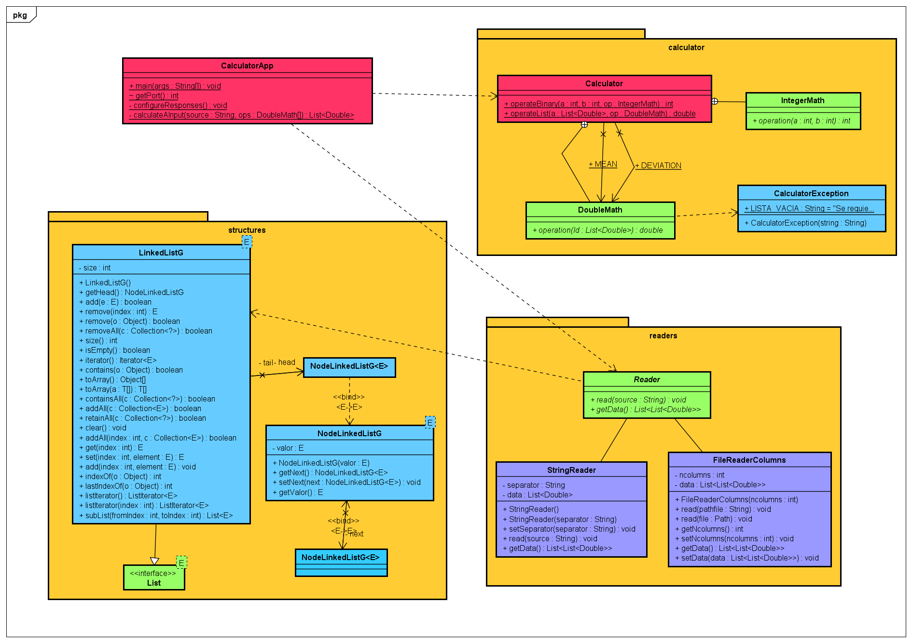
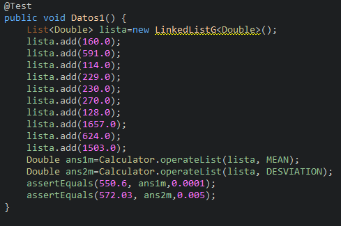
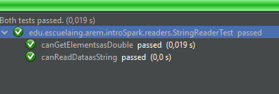

# Introducción a Spark y Diseño de Sistemas

Esta aplicación web permite calcular la media y desviación estándar dado unos datos.



## Autor

* **J. Eduardo Arias Barrera** - [AriasAEnima](https://github.com/AriasAEnima)

# Documento:
## [(Click Aqui)](https://github.com/AriasAEnima/Intro-Computer-Design-Spark/blob/master/informe.pdf)

# CircleCI
[](https://circleci.com/gh/AriasAEnima/Intro-Computer-Design-Spark)

# Heroku

## https://intro-computer-design-spark.herokuapp.com/

## Documentación:

Se encuentra en la carpeta y se puede generar
```
> cd src/main/resources/javadoc
```

### Prerrequisitos

Java JDK 1.8, Maven , Git, Spark (Dependencia)

* [JAVA JDK 8](http://www.oracle.com/technetwork/java/javase/overview/index.html) - Version de Java
* [Maven](https://maven.apache.org/) - Maven
* [JUnit 3.8.1](https://mvnrepository.com/artifact/junit/junit/3.8.1) - Para Pruebas


## Para empezar

Se debe ejecutar en la carpeta que queremos que esté
```
> git clone https://github.com/AriasAEnima/Intro-Computer-Design-Spark.git
```
### Instalación

Primero ejecutamos maven en la carpeta raíz, esto compilara el aplicativo

```
> mvn package
```


## Ejecución:
Podremos usarlo en local directamente con Spark con el siguiente comando
En linux:

```
> java $JAVA_OPTS -cp target/classes:target/dependency/* edu.escuelaing.arep.introSpark.CalculatorApp

```
En windows:
```
> java -cp target/classes:target/dependency/* edu.escuelaing.arep.introSpark.CalculatorApp

```
O con heroku CLI si se tiene instalado con
```
> heroku local web
```

En el caso de usar spark estará en el puerto :

```
localhost:4567
```

En el caso de usar heroku estará en el puerto:

```
localhost:5000
```

Y solo tendremos que colocar los números separados por espacios y . para el decimal y presionar en "Calcular"


## Diseño Utilizado



## Pruebas por JUnit:

Estas se ejecutaran al hacer mvn package






 Test | Expected Mean | Expected Std. Dev. | Ans Mean | Ans D Std. Dev.
 ---|----|----|----|---
 Column 1 | 550.6 | 572.03 | 550.6 | 572.026844746..
 Column 2 | 60.32  | 62.26 | 60.32 | 62.2558306060 ...


## Licencia

This project is licensed under the MIT License  - see the [LICENSE](LICENSE) file for details
